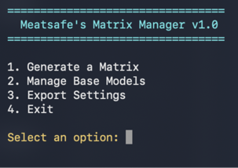
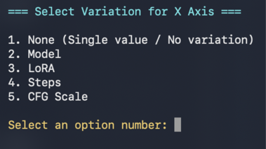
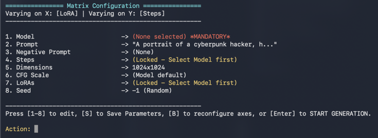
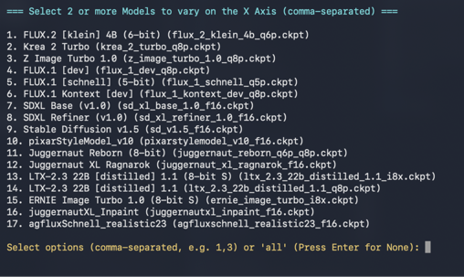
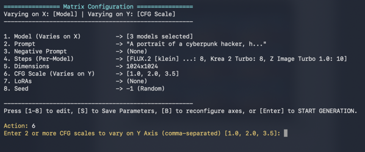
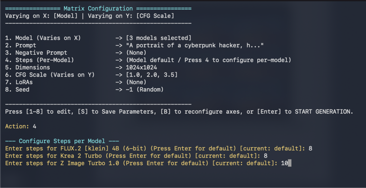
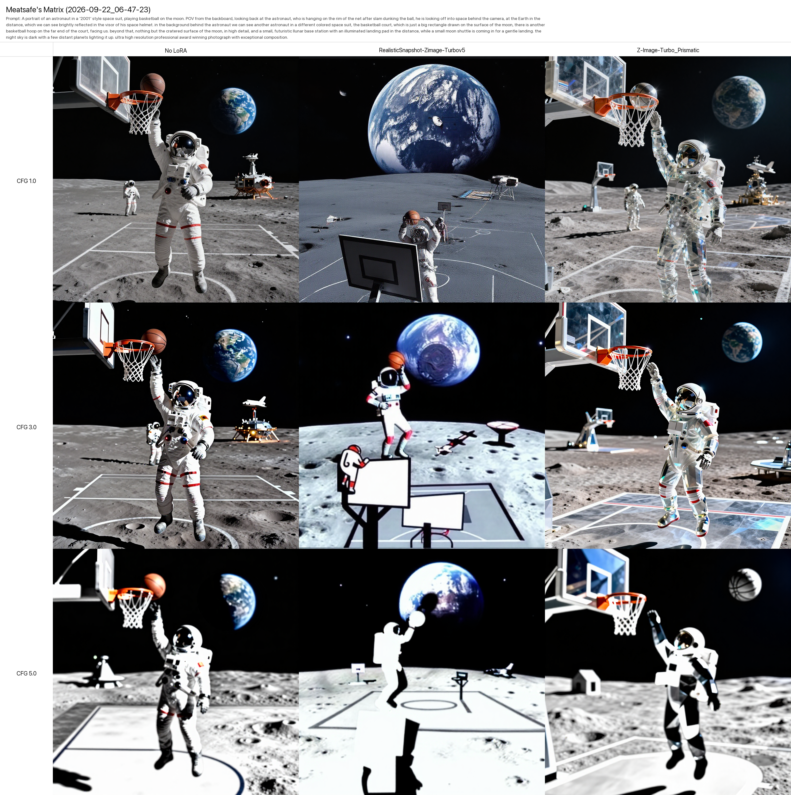
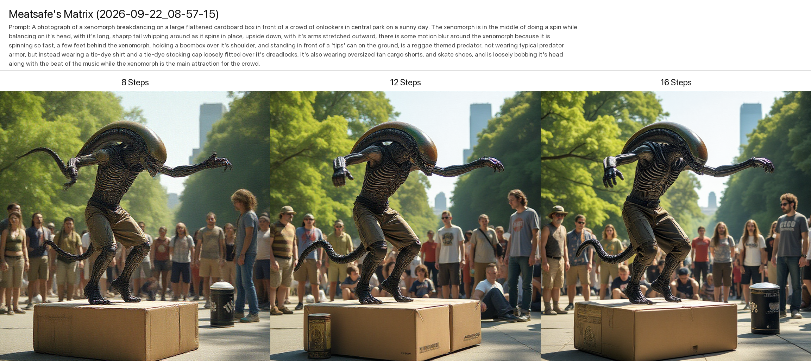

    

<h1 align="center">Meatsafe's Matrix Manager for Draw Things</h1>

   <a>An interactive, terminal-based automation tool for the Draw Things macOS app</a> 

This script utilizes the Draw Things Local HTTP API to generate X/Y comparison matrices, allowing you to systematically test different parameters. It automates the entire batch and outputs a neatly organized HTML spreadsheet and a master PNG grid of your results.

<strong>
    <a href="#features">Features </a>&bull;
    <a href="#pro-tips_for_complex_matrices">Tips </a>&bull;
    <a href="#installation">Installation </a>&bull;
    <a href="#roadmap--coming-soon">Roadmap </a>&bull;
    <a href="#support-the-project">Support The Project </a>&bull;
    <a href="#screenshots">Screenshots </a>&bull;
    <a href="#example-matrices">Example Matrices </a>
</strong>

## Features
* **Axis-Based Matrix Generation:** Choose any two variables to map across the X and Y axes.
* **Auto-Discovery:** Automatically scans and indexes your locally available base models and LoRAs.
* **Smart Filtering:** Only displays LoRAs compatible with your currently selected base model.
* **Parameter Backups:** Save and load your exact matrix configurations (models, prompts, steps, seeds, etc.) for repeatable testing.
* **Flexible Export Options:** Toggle exports for individual PNGs, a master grid PNG, and an HTML grid with prompt metadata.
* **Unhooked from the CLI:** Uses the local HTTP API to reliably manage heavy models without timing out.

## Pro-Tips for Complex Matrices

* **Dynamic Per-Model Steps:** Not all models require the same step count. If you are varying models on one axis (and leaving steps constant on the other), the manager will intelligently prompt you to enter a specific step count for *each individual model* you selected, or let you default to the model's native setting.
* **Universal vs. Varied LoRAs:** When configuring LoRAs, you have two options. **Varied LoRAs** will map to specific columns/rows on your matrix to compare their effects. **Universal LoRAs** (like a turbo or detailer LoRA) will be applied to *every* generation in the matrix, provided they are compatible with the base model for that specific cell.

## Installation

1. **Download the Repository:**
   * Clone this repository via terminal or click "Code" -> "Download ZIP" and extract it. Keep all extracted files together in the same folder so the application can locate the required scripts.

2. **Configure Draw Things:**
   * Open Draw Things.
   * Go to **Settings** and check **Enable API Server** (HTTP, Port 7860).
   
3. **Run the Installer/Launcher:**
   * Open your `meatsafe-matrix-manager` folder.
   * Double-click `Meatsafe Matrix Manager.zip` to unpack `Meatsafe Matrix Manager.app`
   * Right-click `Meatsafe Matrix Manager.app`, and click **Open**.
   * A macOS security prompt will appear warning you that the app is from an unverified developer. Click **Open** to confirm and bypass the block. (You only need to do this the first time).
   * A Terminal window will launch automatically. On the very first run, the script will silently check for and install its required dependencies (`requests`, `Pillow`) before loading the main dashboard.
   * For all future uses, you can simply double-click the `Meatsafe Matrix Manager` icon to start.

## Roadmap / Coming Soon
This is v1.0. Future updates are planned to include:
* Varied LoRA strength testing.
* Full ControlNet profile integration.
* Additional axis variables, including Seed and Sampler comparisons.

---

### Support the Project
Is my code saving hours of time and frustration for you? Consider tipping me a couple of schmeckles! 

☕ [https://ko-fi.com/meatsafe](https://ko-fi.com/meatsafe)

## Screenshots

  

## Example Matrices

